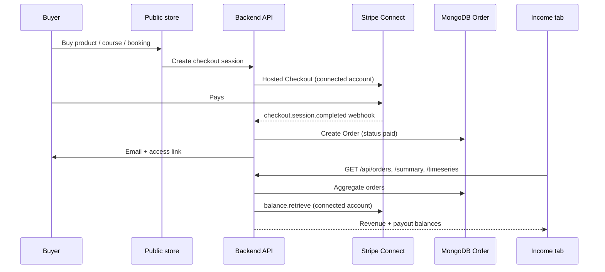

# Income — how it works

This document explains the **Income** tab in the creator dashboard: where sales come from, how amounts are recorded, what you see on screen, and how **cash out** balances relate to Stripe Connect.

**Dashboard location:** Sidebar → **Income** (`/dashboard/orders`)

---

## 1. What Income is (and what it is not)

| Included in Income | Not included |
|--------------------|--------------|
| Paid **product** purchases | Your **Stan platform subscription** (Settings → Billing) |
| Paid **course** enrollments | Free ($0) lead-magnet claims |
| Paid **booking** sessions | Refunded orders (status changes to `refunded`; revenue is removed from totals) |
| PayPal and card (Stripe) sales | Platform invoices for storage add-ons |

Income reflects **money your customers pay you** for items on your store. It is separate from billing you pay to Stan.

---

## 2. High-level flow



**Important:** An order is created when **payment is confirmed**, not when the buyer clicks “Buy”. Confirmation happens via:

1. **Stripe webhook** `checkout.session.completed` (production and local dev with Stripe CLI), or  
2. **Success-page fallback** `POST /api/checkout/complete` (local dev when webhooks are not forwarded)

Until fulfilment runs, nothing appears in Income.

---

## 3. How a sale becomes an order

### 3.1 Checkout types

| Item | Checkout entry | Fulfilment handler |
|------|----------------|-------------------|
| Digital product | `POST /api/checkout/session` | `fulfilCheckoutSession` → entitlement + order |
| Course | `POST /api/checkout/course-session` | `fulfilCourseSession` → enrollment + order |
| Booking | `POST /api/bookings` → `checkoutUrl` | `confirmBookingFromSession` → booking + order |
| Free product | `POST /api/checkout/claim` | `fulfilFreeProduct` → $0 order (shown as **Free**) |

### 3.2 Order record (`Order` model)

Each paid sale creates (or reuses) one row in MongoDB:

| Field | Meaning |
|-------|---------|
| `creatorId` | The seller (logged-in creator) |
| `productId` | Product, course, or booking type ID |
| `buyerEmail` | Customer email from checkout |
| `amountCents` | Gross amount charged (cents) |
| `currency` | e.g. `usd` |
| `applicationFeeCents` | Platform fee taken by Stan (5% on Stripe Connect charges) |
| `status` | `paid`, `refunded`, `pending`, `failed` |
| `fulfilmentStatus` | `fulfilled` when access/email sent |
| `paidAt` | When payment completed |
| `paymentProvider` | `stripe`, `paypal`, `free`, `manual` |
| `stripeCheckoutSessionId` | Idempotency key for Stripe (prevents duplicate orders) |
| `stripeAccountId` | Creator’s Connect account that received the charge |
| `source` | Attribution (e.g. `storefront`, `checkout_page`) |
| `discountCode` | If a discount was applied |

Only orders with `status: 'paid'` count toward **revenue**.

### 3.3 Platform fee (Stripe)

On real Stripe Connect checkouts, the platform charges a **5% application fee** (`APPLICATION_FEE_BPS = 500` in `backend/src/lib/stripe.ts`).

- **Buyer pays:** full listed price (e.g. $29.00)  
- **Creator’s Connect account receives:** charge minus Stripe processing fees minus **5% platform fee**  
- **Income “Total Revenue”** shows the **gross** `amountCents` (what the customer paid), not the net after fees  

Net payout timing and amounts are governed by **Stripe’s balance** (see §6).

### 3.4 Demo mode (no Stripe keys)

If `STRIPE_SECRET_KEY` is unset in development, `demoCheckout` is enabled:

- Checkout simulates payment instantly  
- Orders are still created with `status: 'paid'`  
- **Payout balances stay $0** (no real Stripe account)

---

## 4. Income tab — UI sections

### 4.1 Total Revenue (large number)

- **What it is:** Sum of `amountCents` for all **paid** orders in the **last 30 days**  
- **Date used:** `paidAt`, or `createdAt` if `paidAt` is missing  
- **API:** `GET /api/orders/summary` → `revenueCents`, `orders`, `windowDays` (30)

Subtitle shows order count and **lifetime revenue** (all paid orders, all time).

### 4.2 Revenue chart

- **What it is:** Daily revenue for the last **30 days**  
- **API:** `GET /api/orders/timeseries` → `series[]` with `date`, `label`, `revenueCents`  
- One point per calendar day; days with no sales are zero

### 4.3 Payout panel (right column)

| Label | Source | Meaning |
|-------|--------|---------|
| **Available for Cashout** | Stripe `balance.available` (USD) on the creator’s **Connect** account | Funds Stripe considers available to pay out to the creator’s bank |
| **Available Soon** | Stripe `balance.pending` | Funds not yet available (rolling reserve / settlement delay) |
| **View breakdown** | Mixed | Last-30-day revenue, lifetime revenue, balances, estimated paid out |

**Cash Out** opens your **Stripe Express dashboard** (via `POST /api/orders/payouts/login`) where you transfer to your bank. Actual bank transfers are completed in Stripe, not inside Stan.

The breakdown shows **gross revenue**, **platform fees (5%)**, and **net after platform fees**. It no longer shows a misleading “paid out (est.)” line that mixed gross order totals with net Stripe balances.

### 4.4 Latest Orders table

- **API:** `GET /api/orders` — up to 500 most recent orders  
- Columns: date (paid date), email, product/course/booking title, payment method, amount  
- **Filters:** date, email, product, amount, discount, payment method, status, fulfilment  
- **Download CSV** exports the filtered rows  

The page **refreshes when you return to the tab** (browser visibility) so new sales appear without a manual reload.

---

## 5. API reference (creator-authenticated)

All routes require a logged-in creator (`Authorization` / session cookie).

| Method | Path | Purpose |
|--------|------|---------|
| `GET` | `/api/orders` | List orders with resolved item titles |
| `GET` | `/api/orders/summary` | 30-day + lifetime revenue, order counts, Stripe payout snapshot |
| `GET` | `/api/orders/timeseries` | Daily revenue buckets for the chart |
| `POST` | `/api/orders/payouts/login` | Stripe Express dashboard link for cash out |

### Example summary response

```json
{
  "revenueCents": 8700,
  "platformFeesCents": 435,
  "netRevenueCents": 8265,
  "orders": 3,
  "lifetimeRevenueCents": 24500,
  "lifetimePlatformFeesCents": 1225,
  "lifetimeNetRevenueCents": 23275,
  "lifetimeOrders": 8,
  "windowDays": 30,
  "publishedProducts": 2,
  "payouts": {
    "connected": true,
    "chargesEnabled": true,
    "payoutsEnabled": true,
    "availableCents": 5200,
    "pendingCents": 1800,
    "currency": "usd"
  }
}
```

**Net revenue** = gross minus **platform fees (5%)** recorded on each order. Stripe card processing fees are additional and reflected in the Connect balance, not in these totals.

---

## 6. Cash out — prerequisites and how balances work

### 6.1 Before you can accept payments

1. **Platform Stripe** configured (`STRIPE_SECRET_KEY` in `backend/.env`)  
2. Creator completes **Settings → Payments → Register** (Stripe Connect Express onboarding)  
3. Stripe account has **`charges_enabled: true`**

Until Connect is complete, buyers see “creator hasn’t finished payment setup” and no new card sales are created.

### 6.2 How Stan knows “how much you can cash out”

Stan does **not** calculate this from orders alone. It calls Stripe:

```typescript
stripe.balance.retrieve({ stripeAccount: connectedAccountId })
```

- `balance.available` → **Available for Cashout**  
- `balance.pending` → **Available Soon**  

Stripe controls settlement speed (country, account history, first payout delay, etc.). A sale can appear in **Income** immediately while funds are still **pending** in Stripe.

### 6.3 Where money actually goes

```text
Customer pays $100
  → Stripe Checkout (on creator's Connect account)
  → Stripe processing fees deducted
  → Platform application fee (5%) to Stan
  → Remainder lands in creator Connect balance (pending → available)
  → Creator cashes out to bank via Stripe Dashboard
```

PayPal sales use the creator’s connected PayPal email; balances are **not** shown in the Stripe payout panel (orders still appear in the table with method **PayPal**).

---

## 7. Refunds

When Stripe sends `charge.refunded`:

- Order `status` → `refunded`  
- Entitlements / enrollments revoked  
- Booking may be cancelled  

Refunded orders are **excluded** from revenue totals and the chart.

---

## 8. Relationship to Analytics

| Page | Focus |
|------|--------|
| **Income** | Every order line, payout balances, CSV export |
| **Analytics** | Traffic funnel (views, clicks) + aggregated revenue in a date range |

Both use the same `Order` collection for revenue, but Analytics also uses `AnalyticsEvent` for visits and conversion rates. Numbers should align for the same date range when filtering paid orders.

---

## 9. Local development checklist

1. **Backend** on port **5000** (or your `PORT` in `.env`)  
2. **Frontend** on **3000**; `NEXT_PUBLIC_API_URL=http://localhost:5000`  
3. **Stripe keys** in `backend/.env`  
4. **Connect onboarding** completed for your test creator  
5. **Webhooks** (recommended):

   ```bash
   stripe listen --forward-to localhost:5000/webhooks/stripe
   ```

   Put the printed `whsec_…` into `STRIPE_WEBHOOK_SECRET` and restart the backend.

6. Without webhooks, fulfilment still runs via the **checkout success page** calling `/api/checkout/complete`.

Test card: `4242 4242 4242 4242`, any future expiry, any CVC.

---

## 10. Troubleshooting

| Symptom | Likely cause | Fix |
|---------|--------------|-----|
| Income shows **$0** after a sale | Fulfilment never ran (webhook / complete endpoint) | Run Stripe CLI listener or complete checkout success flow |
| Sale missing from **last 30 days** but in table | `paidAt` older than 30 days | Normal; check **lifetime** subtitle or widen logic |
| **Available for Cashout** is $0 but revenue &gt; 0 | Stripe settlement delay or Connect not linked | Check Stripe Dashboard → Connect → Balance |
| Payout panel always $0, “Connect Stripe…” | Connect onboarding incomplete | Settings → Payments → finish Stripe setup |
| Buyer can’t pay | `canAcceptPayments` false | Creator must complete Connect; no fake `acct_seed_*` accounts when Stripe is configured |
| Demo mode sales, no real money | No `STRIPE_SECRET_KEY` | Add Stripe keys; restart backend |

---

## 11. Key source files

| Area | Path |
|------|------|
| Income UI | `frontend/src/app/dashboard/orders/page.tsx` |
| Orders API | `backend/src/modules/orders/orders.routes.ts` |
| Revenue / payout logic | `backend/src/modules/orders/orders.service.ts` |
| Order model | `backend/src/models/Order.ts` |
| Checkout fulfilment | `backend/src/modules/checkout/fulfilment.service.ts` |
| Stripe Connect | `backend/src/modules/payments/connect.service.ts` |
| Webhook | `backend/src/modules/webhooks/stripe.webhook.ts` |
| Platform fee | `backend/src/lib/stripe.ts` |

---

## 12. Quick summary

1. **Customer pays** → Stripe/PayPal checkout on the creator’s connected account.  
2. **Webhook or success handler** → creates a **paid Order** in the database.  
3. **Income tab** reads orders for revenue, chart, and order list.  
4. **Cash out amount** comes from **Stripe Connect balance** (`available` / `pending`), not from summing orders.  
5. **Total Revenue** is **gross customer spend** in the last 30 days; fees and payout timing are handled by Stripe.
